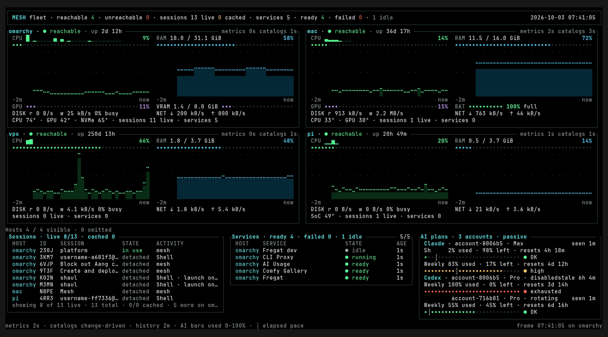

# mesh

every terminal on every machine you own, from wherever you are



mesh runs terminal sessions on the machines in your tailnet and opens any of them from any other, or from your phone. a session lives on its host. close the laptop, switch networks, restart the daemon, and the command keeps running until you come back to it

built for running claude code and codex across a desktop, a laptop, a pi and a vps: agents keep working while you're away, you pick them up from whatever is in your hand, and one screen shows what every machine and every agent is doing

## try it

mac

```bash
brew tap ShaulLavo/mesh https://github.com/ShaulLavo/mesh
brew install --cask ShaulLavo/mesh/mesh
```

linux

```bash
curl -fsSL https://raw.githubusercontent.com/ShaulLavo/mesh/main/scripts/install.sh | sh
```

then

```bash
mesh                # pick a host and a session
mesh pc             # new session on pc
mesh pc -r          # back to the latest one
mesh pc -- htop     # run one thing there
mesh add user@host  # put mesh on another machine
```

`ctrl+]` detaches. the command keeps running

## what's in it

- **sessions.** each one is a process on its host with its screen kept in memory. attach from anywhere and it redraws where you left it. the picker lists every host and session with a live view of each screen
- **agents.** `mesh agent setup claude --install` (or `codex`) records every conversation, so a session reopens its exact conversation after a crash. idle agents hibernate to give their memory back and resume when you attach. [recovery](docs/agent-recovery.md), [hibernation](docs/hibernation.md)
- **dashboard.** `mesh dashboard` is cpu, ram, gpu, disk, network, temperatures and battery for every machine, what each session is doing, service health, and how much of each claude and codex plan is left. `--wall` is the hands-free version for a tv. ours runs on a pi. six themes. [dashboard](docs/dashboard.md)
- **crash recovery.** after a reboot, sessions come back as interrupted with their directory, shell history and last screen, ready to relaunch with one key. [workspace recovery](docs/recovery.md)
- **serving.** `mesh serve` puts a port, a folder or a static site at a private https url on your tailnet. a dev server can start on its first request and stop once idle. `mesh app create` turns files or a folder into a short-lived website, and a reverse tunnel publishes a local app on a public hostname. [on demand](docs/serve-on-demand.md), [temporary apps](docs/temporary-apps.md), [public edge](docs/reverse-tunnels.md)
- **ssh.** every host answers ssh on port 2222 with the picker, its sessions, and read-only sftp and scp of what it serves. any ssh client works, phones included. [remote access](docs/remote-access.md)
- **fleet.** `mesh add user@host` installs mesh, and tailscale if needed, over ssh. `mesh update` rolls one release across every machine, and offline ones catch up when they return. [updates](docs/updates.md)
- **power.** `mesh wake pc` wakes a sleeping machine through an awake neighbor on its lan, and a host with running sessions stays awake. [wake](docs/power.md)
- **privacy.** `mesh --privacy`, or `MESH_PRIVACY=1` for a whole shell, masks account names, home directories, ids, ips and private domains while host, session and service names and every stat stay readable. made for recording and screen sharing, this gif included. [privacy](docs/privacy.md)
- **terminal windows.** set your terminal's command to `mesh --window` and every window's shell outlives the window. [setup](docs/terminals.md)

## more

- [macos](docs/macos.md), quarantine and file access
- [development](docs/development.md), gates, hooks and the integration suite
- [status](docs/plan/02-status.md) and [task briefs](docs/tasks/)
