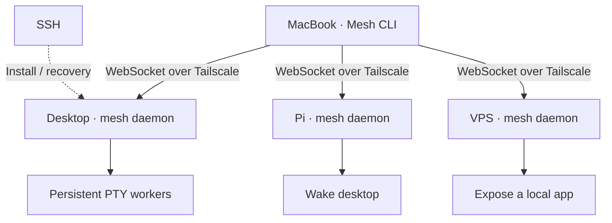

# Mesh v0 — overview

Mesh is a Go application that gives you direct, resumable terminal sessions across
your Tailscale-connected computers.

It is not a VPN, scheduler, coding agent, MCP platform, deployment system, or
personal assistant — yet. Those can consume Mesh later.



## The contract

Non-negotiable invariants, repeated in `CLAUDE.md` because they are the product:

- Connections are disposable.
- Sessions belong to the remote host, not the client connection.
- Losing wifi, closing the MacBook, or killing `mesh` must not kill the command.
- Traffic goes directly to the destination machine.
- The Pi helps with waking and discovery; it does not proxy terminal traffic.
- Tailscale handles networking and reachability. Mesh handles sessions,
  reconnection, history, and UX.
- Rebooting a host kills its processes. Mesh reports those sessions as
  `interrupted`.

## CLI

```bash
alias m=mesh

m pc                 # always create a new session
m pc -r              # resume latest active session on pc
m 7K3D               # attach exact session
m                    # interactive host/session picker
m ls                 # sessions across every known host
m logs 7K3D
m kill 7K3D
m wake pc

mesh add shaul@pc    # SSH bootstrap, once per machine
```

`mesh add` uses SSH to install and start Mesh, records the stable Mesh identity,
discovers its Tailscale address, and verifies the WebSocket connection. After
that, SSH disappears behind the curtain.

## Runtime design

Every machine runs `mesh daemon`. When the daemon creates a terminal session it
launches a detached `mesh session-worker` process, which:

- owns exactly one PTY;
- owns the shell / Codex / Claude process;
- survives the CLI disconnecting;
- survives the main daemon crashing and restarting;
- maintains output sequence numbers;
- stores bounded scrollback;
- exposes a local Unix socket;
- maintains terminal state for clean reattachment.

The daemon is a coordinator. It rediscovers existing workers after a restart and
connects remote WebSocket clients to them. If the daemon owned every PTY, a daemon
update would nuke live work — the precise clownery Mesh exists to prevent.

## Transport

WebSockets over Tailscale.

- One WebSocket per client-to-host connection; sessions multiplexed over it.
- JSON control messages, binary frames for terminal data.
- Compression disabled. Output batched.
- Ping/pong for health; reconnect with backoff.
- Local daemon-to-worker communication over Unix sockets, same framing.

On reconnect the client sends its last acknowledged sequence. The host returns
missed output, or a fresh terminal snapshot if the replay window has expired.

## Session data

SQLite stores metadata, never the live process:

```
id · host_id · command · cwd · state · created_at · last_attached_at ·
exit_code · last_output_sequence
```

States: `running`, `detached`, `exited`, `interrupted`.

`m ls` queries every known online host concurrently, merges results, falls back to
a local cache for offline hosts, and marks cached rows as stale. The Pi may cache
summaries later; it never owns another machine's sessions.

## Stack

Core: Go 1.27 · Cobra · Fang · `coder/websocket` · `modernc.org/sqlite` · sqlc ·
Goose · `golang.org/x/crypto/ssh`.

Charm, with the versions that actually resolve as of 2026-08-30: Bubble Tea
v2.0.9 · Bubbles v2.2.1 · Lip Gloss v2.0.6 · Huh v2.0.3 · Fang v1.0.0 · Charm Log
v1.0.0 · Wish v1.4.7 · `ultraviolet` · `x/xpty` · `x/vt` · `x/ansi` · `x/term` ·
`x/exp/golden`.

The v2 line is not a preference. `internal/terminal` already builds on
`ultraviolet`, and Lip Gloss v1 would put a second colour and rendering stack in
the same binary. Wish is still v1; there is no v2 to pin.

Pin the experimental packages to exact versions and hide them behind internal
interfaces so API churn stays contained.

## Build order

1. **Local persistent session** — daemon, detached worker, PTY, Unix socket
   attach, detach/reattach, resize, signals, bounded output. *This is the heart.*
2. **Remote session over Tailscale** — WebSocket server, binary streaming, control
   protocol, reconnect/backoff, sequence acknowledgement, host identity, Tailscale
   address discovery.
3. **Product CLI** — host aliases, `m pc`, `-r`, `m 7K3D`, `ls`, `logs`, `kill`,
   interactive picker.
4. **SSH bootstrap** — `mesh add`, OS/arch detection, install, service unit,
   identity, host record, connection test, useful diagnostics.
5. **Crash and restart recovery** — every disconnection mode, worker rediscovery,
   `interrupted` marking.
6. **Pi power control** — `m wake pc`, wake-then-connect flow, sleep inhibitors.
7. **Packaging** — systemd, launchd, GoReleaser, Actions, Homebrew Cask, installer,
   VHS demos, race tests, protocol fuzzing, govulncheck, golangci-lint v2.
8. **Serving** — static sites, file browsers and local-port proxies. Private on
   the tailnet at `<host>.mesh.shaulavo.dev`, and optionally public under
   `shaulavo.dev` through the VPS edge. See `docs/plan/03-serving.md`.
9. **SSH front door** — a Wish server per host so any machine with `ssh` reaches
   a session, mounts served roots over SFTP, or publishes a port through the edge
   with `ssh -R`. Not a transport; the client that already exists everywhere.
   See `docs/plan/04-ssh.md`.

## Explicitly later

MCP/tools · coding-agent knowledge · job scheduling · personal assistant ·
native mobile app · GUI editor · collaborative writers · sharing meshes with
other users · replacing Tailscale · arbitrary proxying through the Pi.

Deployment is not on that list, because it is not a later Mesh feature at all. A
separate product handles sharing work with other people: dev builds, preview
links, sending someone what you are working on. Mesh serving publishes something
that already runs on a machine you own, for you to reach from outside. See D22
for where the line falls and how to tell which side a request is on.

Serving (step 8) is deliberately scoped proxying through the VPS, not the general
case.

Step 9 adds `ssh -R` on top of that, which is a *named* forward: authenticated,
bound to a route the user claimed, refused if another host holds the name, and
gone on disconnect (D20). Arbitrary tunnels stay out.

A native mobile app moved further down the list rather than closer. A phone with
the Tailscale app and any SSH client is already a complete client once step 9
lands (D21).

The extension point is the daemon protocol. Anything built later calls Mesh
exactly like the CLI does.
