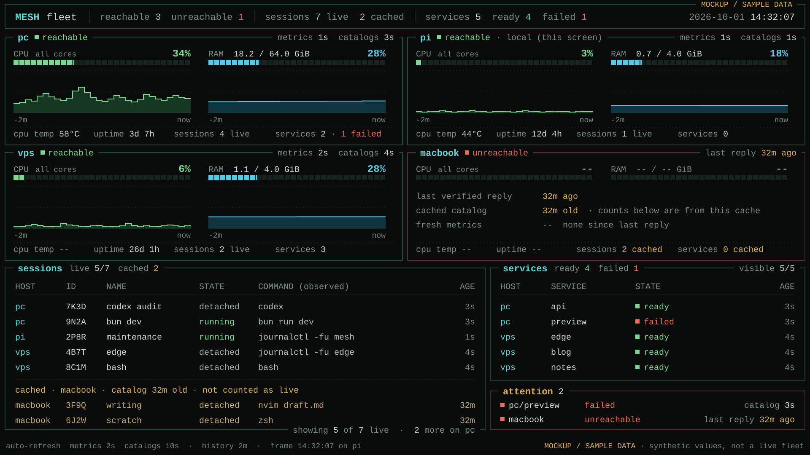

# Terminal fleet dashboard

Status: Approved, 2026-10-01. Implementation follows the active audit.

**Paused 2026-10-01 (owner):** resumes after [plan 08](08-streaming-and-performance.md) step 4. The monitor then reads hosts through `state.watch` instead of polling; see plan 08, "Plan 07 changes".

## Outcome and usage

The Raspberry Pi boots into a readable Mesh dashboard on its 4K TV. A glance
shows every adopted machine, whether its Mesh daemon is reachable, CPU and RAM
usage, CPU temperature where available, and session/service counts. Compact
session and service summaries share that same screen. The Pi has no keyboard,
so its display requires no selection, navigation, or input.

These are target commands for implementation:

```sh
mesh dashboard          # passive view; layout follows terminal dimensions
mesh dashboard --wall   # fullscreen TV view, no navigation or controls
```

Bare `mesh` keeps its existing picker. The dashboard is a read-only viewer.
Each machine remains authoritative for its own data. The Pi is an ordinary
client, never a session database or traffic proxy.

## One information-packed screen

Use dense square terminal panels, inspired by btop, with two columns when space
permits. Each machine panel shows alias, reachability, CPU percentage and meter,
used/total RAM and meter, named temperature, two-minute CPU/RAM histories, uptime,
session/service counts, and data age. Below them, fixed session and service
tables show useful commands, reported states, and health. Put connection failures,
refused identities, and unhealthy services beside the affected data, rather than
reserving a large mostly empty attention panel.

There are no buttons, tabs, key hints, selected borders, detail screens, or
automatic view switching. The screen stays useful indefinitely without input.
Use a near-black background, green CPU graphs, cyan memory graphs, amber for
cached ages, and red for reported failures. The terminal grid, compact meters, aligned columns, and
square borders supply the hacker aesthetic. Readability matters more than glow
or decorative effects.



This is an Opus-generated design mockup with sample machines and measurements,
not a running dashboard. Labels were checked against this plan and corrected
for the polling cadence. The [SVG source](assets/dashboard-wall.svg) preserves
the layout.

Start with cards at roughly 140 columns by 40 rows, a table below that, and a
compact list at 80 by 24. Confirm the breakpoints with real terminal rendering.
Below the minimum, show a readable resize message. Use room-distance readability
to choose the foot font size, initially aiming for about 150–180 columns. The
current 480-column console is too dense for this purpose.

Keep host order stable across refreshes. Fit the Pi's configured fleet on one
screen. As the fleet grows, reduce panel detail and switch to a denser fleet
table before hiding hosts. For genuine size overflow, show the total and omitted
count explicitly; verify that none of the actual configured hosts is omitted
during TV setup. Session/service summaries show visible and total counts.
Prioritize reported failures in the service summary. Keep cached session counts
separate from live observations. There is no paging, filtering, scrolling, or
keyboard-dependent recovery in wall mode.

Use Mesh's existing theme stack, restrained borders, consistent CPU/RAM colors,
and clear labels. Status text must remain understandable without color.
Use Unicode graphs in foot and simple block/ASCII fallbacks on the Linux console.
Adapt btop's graph and terminal fallback choices and bottom's space allocation;
neither becomes a runtime dependency.

## What already exists

Most of the product plumbing is present at source baseline `492ae74`:

| Need | Reuse |
| --- | --- |
| Inventory | `LoadHosts`, local identity, existing host address book |
| Sessions and services | Existing `session.list`, `service.list`, and cached catalogs |
| Session summaries | Existing catalog command/state fields, with bounded existing inspection for foreground command and recent-output age |
| Authentication | Existing adopted host ID and Mesh identity verification |
| Terminal UI | Bubble Tea v2, Bubbles v2, Lip Gloss v2 |
| Refresh behavior | Existing cancellation, generation checks, stable identity matching, stale retention |

The inventory includes adopted Mesh hosts plus this host, deduplicated by
identity. Configure the Pi's address book during setup. It is not automatically
every Tailscale or ZeroTier device.

Whole-machine CPU, RAM, temperature, and uptime are the missing measurements.
Existing session memory is process-tree PSS plus swap, cached for ten seconds on
Linux. It cannot stand in for host RAM. Reuse existing inspection only for the
visible session summary rows, at most six sessions every ten seconds. Share the
global read limit, retain stale results, and do not attach a PTY or inspect every
session at every fleet refresh. Catalog launch commands remain useful before
an inspection succeeds. Full terminal previews stay in the existing picker.

Relevant source is [CLI wiring](../../internal/cli/command.go),
[verified host reads](../../internal/cli/remote.go),
[one-shot service transport](../../internal/cli/service_remote.go),
[picker refresh](../../internal/cli/picker_refresh.go),
[inspector](../../internal/tui/inspector.go),
[host protocol](../../internal/protocol/control.go), and
[session memory sampler](../../internal/daemon/hibernation.go).

## Measurement contract

Add a narrow `host.metrics` request and `host.metrics.result` response. Keep
session and service lists as their existing requests. Every metric carries its
availability, sample identity, and monotonic age at response generation.

| Value | Meaning |
| --- | --- |
| CPU | Aggregate utilization from two counter observations, normalized to 0–100% across all cores. Linux idle and iowait are idle; avoid double-counting guest time. The first observation establishes a baseline. |
| RAM | Total minus OS-reported available memory, displayed alongside total bytes in GiB. Label the platform's available-memory estimate accurately. Do not treat all file cache as occupied application RAM. |
| Temperature | A named CPU/package sensor in Celsius. On the Pi, use the CPU thermal sensor. Missing sensor data stays unavailable. |
| Uptime | OS-reported time since boot. |
| Sessions/services | Existing reported states and counts, with their own last-success ages. A running shell does not prove that a machine is busy. |

Display actual utilization and temperature rather than inferred WORKING, HOT,
COLD, or ASLEEP labels in v1. A timeout means unreachable from this viewer.
Session hibernation is a separate, explicit session fact. Temperature warning
thresholds require a reported hardware limit, not a universal guessed number.

Use `internal/hostmetrics` to hide platform collectors and sampling. Choose
`github.com/shirou/gopsutil/v4` for CPU counters, memory, and uptime on Linux and
Darwin; pin and justify the dependency in the implementation task. It avoids
duplicating platform APIs and reports a no-cgo implementation. Verify Linux
ARM64 and Darwin builds and actual field semantics before accepting the adapter.
Use bounded Linux sensor reads for temperature; unsupported platforms require
no privilege escalation. [gopsutil upstream](https://github.com/shirou/gopsutil).

Sample on demand, shared across viewers, at most once per two seconds for CPU/RAM
and once per ten seconds for temperature. Do not sleep in the request handler to
measure CPU or start a permanent sampling loop. Coalesce concurrent collection.
After a long gap, establish a new CPU baseline rather than claiming a long-term
average is a current reading. Sampling failures retain each metric's last good
value and age independently.

## Reads, freshness, and compatibility

The monitor owns section schedules and returns complete retained host views.
The TUI receives immutable messages and owns only rendering and graph history.
It does not coordinate protocol requests or capability checks.

Use `DialControl` through `transport.DialOnce`, verify `host.info`, and perform
each subsequent read on that verified connection. Never use `DialHost` recovery
for dashboard polling. The generic session collector currently reaches that
recovery path, which can wake a host. Reuse its catalog logic only with the
one-shot dialer explicitly injected. Preserve this requirement in compatibility
fallbacks and automatic visible-session inspection too.

Poll reachable hosts' metrics every two seconds and catalogs every ten seconds.
Use a global maximum of four concurrent network reads, a 1.5-second read deadline,
and one outstanding read per host. Schedule due sections fairly and never let
failed catalogs starve metrics. Larger fleets may refresh more slowly; show
actual ages. Failed connections back off at 5, 10, 20, 40, then 60 seconds.
Section failures have their own backoff and do not invalidate other successes.
Cancel all work on termination and reject late results after inventory or visible
summary-row changes. Existing `session.list` can scan process memory, so measure its cost at
the ten-second cadence rather than promising cost-free reuse.

Successful verified `host.info` establishes daemon reachability. A metric failure
does not make that host offline. Wrong identity is a refused connection; do not
attribute returned data to the adopted machine. Retained old values remain
visibly stale. Unsupported metrics differ from collection errors and from stale
measurements. Older hosts keep useful catalogs.

Detect unsupported controls only through the daemon's explicit unknown-control
response, never a timeout or general error. Cache the result for the observed
host identity and build, and reprobe when the build changes. Parse older generic
error responses at the reader boundary; do not broaden the protocol's error
model just for this feature.

Convert remote metric ages to a local monotonic basis, conservatively accounting
for request transit time. Daemon wall clocks are not the freshness authority.
Repeated sample IDs must continue aging. CPU, RAM, and temperature each retain
their own timestamp. Mark CPU/RAM stale after ten seconds and temperature after
thirty seconds; catalogs show their last-success age and a stale flag after
thirty seconds. A known failed refresh marks the relevant retained section stale
immediately.

Keep graph points for the last 120 seconds, bounded to 64 distinct samples per
metric. Store time and sample IDs; prune by time, not only count. Draw gaps on
missing observations. Reboot, sampler restart, or CPU counter reset starts a new
segment. Never fill a disconnected interval with invented zeroes. Graph history
is in-memory on the viewer and can start empty after reboot. CPU and RAM graphs
use a fixed 0–100% scale so a quiet machine does not look as busy as a loaded one.

## Shape for implementation

The caller supplies inventory and read callbacks, following the picker pattern:

```go
input := cli.DashboardInput{
    Hosts:   inventory,
    Watch:   monitor.Run,
}
// New dashboard entry in internal/tui; messages enter Bubble Tea's update loop.
```

The central contract is one cancellable watch, with clocks and version handling
inside the monitor. These are signature sketches, not new source files:

```go
type DashboardWatch func(context.Context, func(DashboardHostView)) error

type Measurement[T any] struct {
    State      MeasurementState // available, unsupported, unavailable
    Value      T
    Sample     SampleKey        // sampler instance, segment, sequence
    MeasuredAt time.Time        // translated local monotonic basis
    Problem    string
}

type DashboardHostView struct {
    Host         DashboardHost
    Reachability Reachability
    LastReply    time.Time
    CPU          Measurement[float64]
    RAM          Measurement[MemoryUsage]
    Temperature  Measurement[Temperature]
    Uptime       Measurement[time.Duration]
    Sessions     ObservedSessions
    Summaries    ObservedSessionSummaries
    Services     ObservedServices
}
```

Domain session/service rows adapt existing catalogs and bounded inspection
behind the monitor. The monitor chooses at most six stable rows to enrich;
the renderer displays as many of those rows as fit. More catalog rows may be
displayed without inspection. The monitor owns the inspection schedule.
Wire controls, collector types, and remote addresses stay out of dashboard
rendering. Availability determines whether a zero is a valid reading. The watch
returns only after its workers stop. Publication crosses Bubble Tea's message
boundary, never mutates its model from background goroutines.

| Location | Ownership |
| --- | --- |
| `internal/hostmetrics` | Platform readings, shared sampling cache, reset/sample identities |
| `internal/protocol` | Additive metric request/response and boundary validation |
| `internal/daemon` | Report this host's measurements |
| `internal/cli/dashboard*.go` | Inventory, safe reads, capability handling, retained views, scheduling |
| `internal/tui/dashboard*.go` | Passive layouts, fixed summaries, graph history and resize |
| `cmd/mesh` | Inject dashboard entry alongside existing picker |

## Pi display and boot

Read-only inspection found a Raspberry Pi 4 Model B, ARM64, Debian 13.6, booting
to `multi-user.target`. The TV is on physical `tty1` through `vc4drmfb`, at
3840×2160 and 30 Hz. No graphical session or replacement terminal is installed.
There is currently no console autologin.

Use Cage plus foot. Cage supplies a single fullscreen Wayland application from
a TTY; foot supplies fonts, modern terminal rendering, and the dashboard process.
Both have ARM64 candidates in this Pi's configured package sources. Validate a
manual session before changing boot behavior.
[Cage](https://github.com/cage-kiosk/cage),
[foot manual](https://manpages.debian.org/trixie/foot/foot.1.en.html).

Ghostty v1.3.1 requires desktop OpenGL 4.3 for its Linux OpenGL renderer. Pi
driver developers document native desktop OpenGL 3.1 for this GPU family. That
makes its normal hardware path a poor fit here. Alternative render paths were
not tested. The display choice does not affect the dashboard implementation.
[Ghostty renderer source](https://github.com/ghostty-org/ghostty/blob/v1.3.1/src/renderer/OpenGL.zig#L33),
[Pi driver team slides, pages 2 and 5](https://archive.fosdem.org/2025/events/attachments/fosdem-2025-5553-getting-more-juice-out-from-your-raspberry-pi-gpu/slides/238057/20250201-_0Ym02Fd.pdf).

During setup, back up affected configuration and launch the session as the
existing non-root Mesh owner through a proper local login/seat. Preserve its
Mesh identity and address book. Keep SSH and a spare recovery VT available.
Add boot startup only after graphics work. Start the wall without an attached
keyboard and disable display blanking for this kiosk session. Restart on crashes
with bounded backoff. Normal remote shutdown must stop cleanly; a remote service
stop must remain stopped. Verify real reboot, network
loss, daemon restart, and remote recovery. Room-distance font testing remains
necessary; package availability alone does not prove the display session works.

## Design decision and execution

Initially compared a fleet table with selected detail against a whole-fleet card
wall. Independent review scored them 22 and 25 out of 30. The owner's subsequent
direction makes the Pi a passive screen without a keyboard. Use the wall as the
TV base, pack more information into it, remove selection/navigation entirely,
retain a passive compact table, and take the table candidate's narrow metrics query.
Reject a combined `host.observe` RPC because it couples cheap measurements to
unrelated catalogs. Reject running-process activity guesses and an always-on
sampling loop. The monitor hides refresh policy behind one watch operation,
which keeps protocol and timing decisions out of rendering.

Accept slower catalog updates in exchange for lower repeated process inspection
cost. Accept optional temperature readings and viewer-local history in exchange
for predictable behavior across platforms and no new central storage.

Execute after the audit in these verifiable steps:

1. Reuse plan 08's sampler, `host.metrics` request and `metrics` watch topic.
   Verify, before building on them: CPU baseline/reset, RAM semantics, optional
   sensors, independent ages, shared sampling, and idle overhead on Linux ARM64,
   with Linux and Darwin builds. Fix gaps there, in plan 08's code.
2. Add the safe monitor and `mesh dashboard` entry. Prove identity checks,
   partial success, older-host fallback, fair scheduling, cancellation, and zero
   wake calls through the actual CLI wiring, including failed reads and fallbacks.
3. Build dense panels, passive table, and fixed summaries using existing catalogs
   and bounded inspection.
   Inspect fixtures at TV and 80×24 sizes, with clock skew, repeated samples,
   disconnected gaps, long aliases, more hosts than fit, and stale RAM with fresh
   CPU. Verify an idle running shell does not acquire a busy label. Run indefinitely
   with no keyboard or input. Exercise resize and terminal cleanup on termination
   in a real terminal. Confirm there are no controls, navigation hints, or hidden
   pages in the wall view.
4. Measure fleet polling cost, then configure Cage/foot on the Pi. Test manual
   startup, readability, auto boot without a keyboard, no screen blanking,
   clean remote stop, crash recovery, and SSH recovery.
   Run repository checks for the eventual code change.

The first implementation step verifies plan 08's sampler and watch contract.
The first integrated slice should already show real CPU/RAM for one host in the
terminal, through `state.watch`, before adding the full wall or boot setup.
