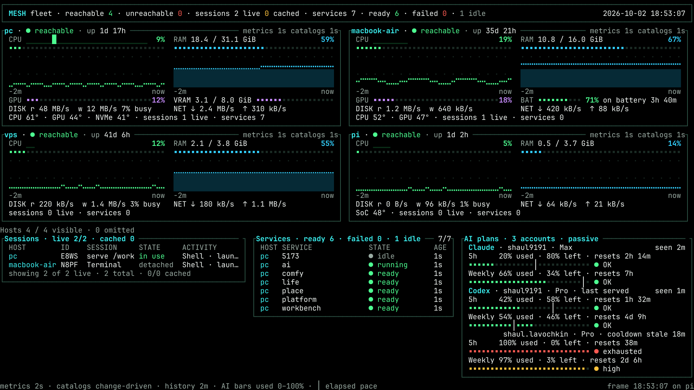
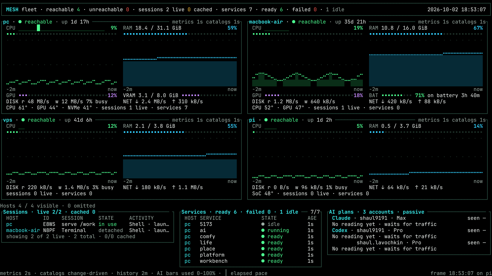
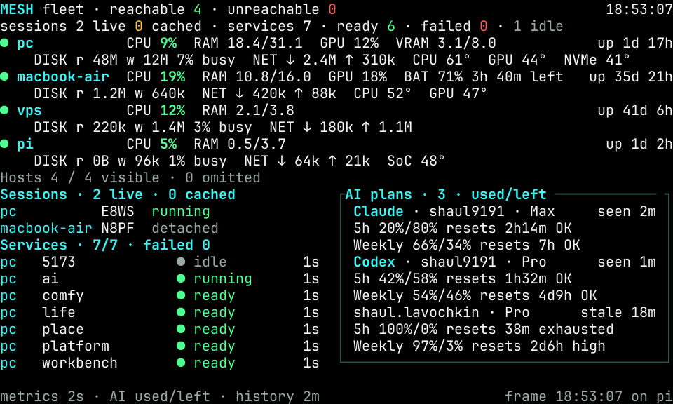
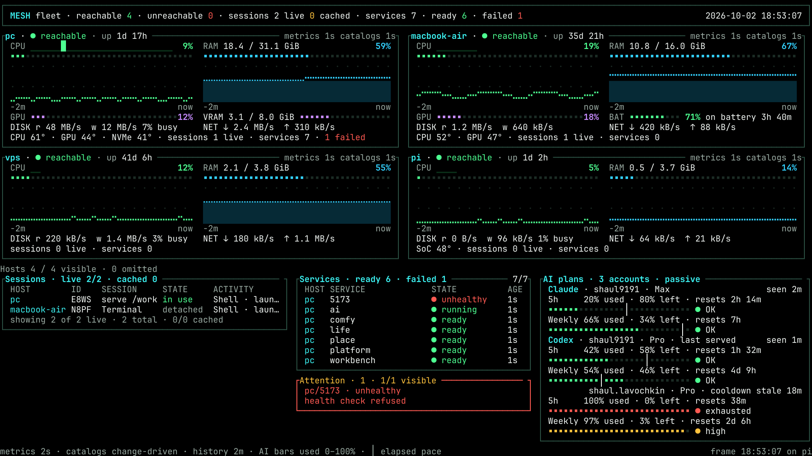
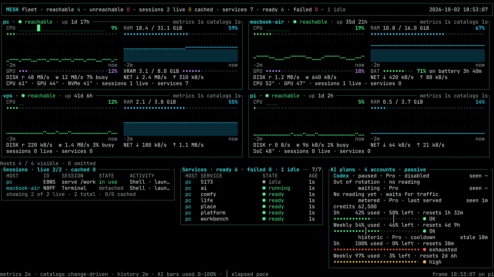
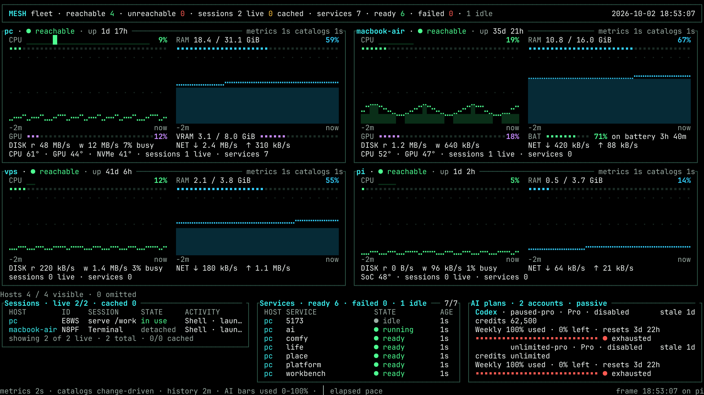
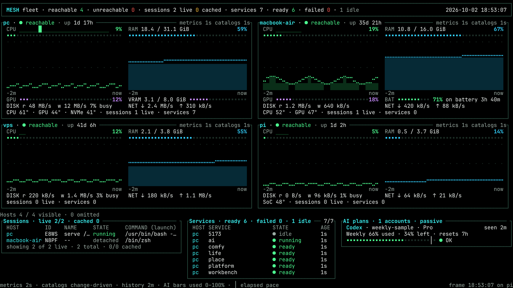
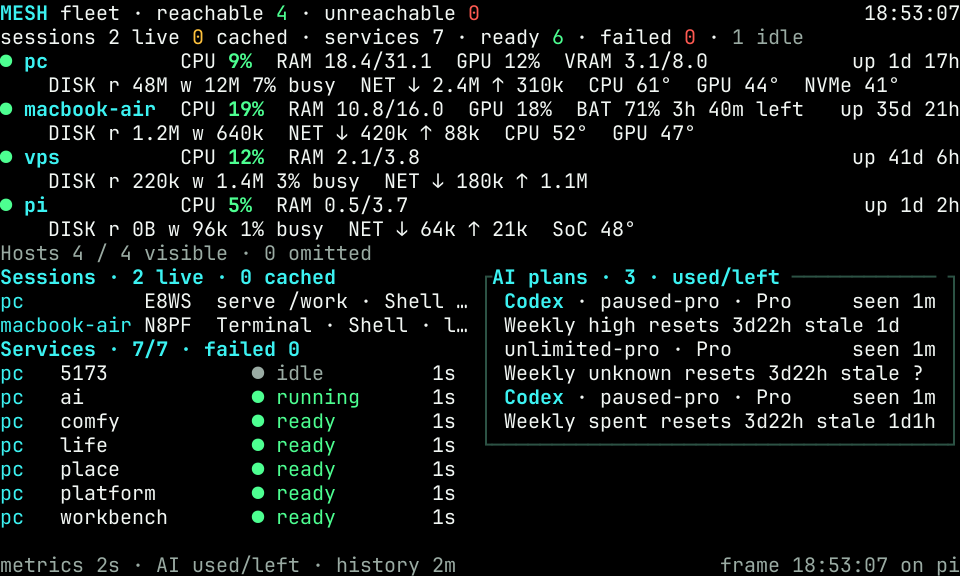

# Generic usage feed on the TV dashboard

Status: Approved, 2026-10-02. Generic consumer and dashboard implemented;
local fixture verification complete. Independent review corrections are implemented;
review acceptance, live static-route checks and Pi deployment remain separate
delivery steps. The owner's
approved October 2 normal and no-data designs remain authoritative.

Canonical source inventory, contract and gateway implementation plan:
[Fregat Plan 289](https://github.com/ShaulLavo/fregat/blob/main/plans/289-proxy-usage-feed.md).
This extends [07: terminal fleet dashboard](07-dashboard.md); it does not replace
its host watch transport, session details, theme or Pi setup work.

## Boundary and configured accounts

Mesh is a generic read-only viewer of a versioned JSON snapshot. The producer
belongs to Fregat's existing Claude/GPT gateway tooling beside CLIProxyAPI.
It captures Claude quota headers from normal gateway traffic and reads the
proxy's already-recorded per-account GPT quota/cooldown state through localhost
management. Fregat's present native usage cache is outside this build; later
Fregat consumption of this feed is a separate follow-up in Plan 289.

The approved configured identities and order are:

| Provider | Short account label | Plan | Observation path |
| --- | --- | --- | --- |
| Claude | `shaul9191` | Max | Passive quota headers on the owner's own Claude Code traffic through our gateway |
| Codex | `shaul9191` | Pro | CLIProxyAPI's per-credential cached observations |
| Codex | `shaul.lavochkin` | Pro | CLIProxyAPI's per-credential cached observations |

**Both Codex accounts are Pro. Claude is gateway-only and is never pooled or
proxied through CLIProxyAPI.** No Claude session traffic means its last actual
observation ages into stale data; there is no background Claude quota probe.
Providers own ordered lists of accounts: Gemini or another provider is an
additional group, with no provider-specific layout branch.

No provider collector, OAuth handling, quota probing, account selection or reset
logic belongs in Mesh. No new dependency is needed: Go's HTTP/JSON support and
existing dashboard projection/rendering suffice. Keep the data out of fleet host
metrics and the session protocol.

## Producer prerequisite and URL

Management is already enabled on loopback port **18317**. Its private key file is
`/work/cli-proxy-api/management-key`. The Mesh `/ai` frontend is on **8318**;
installed runtime configuration reports the gateway backend on **18318** and
CLIProxyAPI on **18317**. These operational ports are not portable test constants.
The producer uses validated runtime configuration. Management stays loopback-only;
the key's contents never enter a feed, log, screenshot or Pi configuration.
There is no management enablement or proxy restart prerequisite left in this
plan. This consumer implementation makes no installed runtime changes, proxy
restarts or provider calls.

A dedicated sanitized directory is served through a **tailnet-only isolated
static route**, for example `https://omarchy.mesh.sprockt.dev/ai-usage/v1.json`.
This example route is not provisioned by the consumer implementation. It is separate from the
on-demand `/ai` backend and keeps serving the last file while inference sleeps.
Static serving belongs to the existing Mesh daemon, not a new collector service.

Feed reads must not start `/ai`, extend its idle deadline, invoke readiness or
model discovery, touch providers, refresh credentials, drain the proxy usage
queue, or wake a host. An unreachable producer means cached/stale data on the Pi.
Tailnet ACLs and route isolation protect the sanitized feed; ordinary browser
Origin/device pairing from Fregat is not the Go client's authentication mechanism.

## Contract to consume

Use Plan 289's JSON v1 schema, not a provider response shape:

- `schemaVersion`, publication `generatedAt`, and all known `accounts`.
- Account opaque stable `id`, generic `provider`, safe `label`, `plan`, `state`,
  `source`, cache-inspection `checkedAt`, actual quota-observation `lastSeenAt`.
- `routing {mode, active, lastServedAt}`: active is boolean or **null**;
  cooldown contains a sanitized reason/recovery time or null.
- Optional account `credits {balance, unlimited}`: a finite nonnegative balance
  and a boolean; absence means no credit observation.
- `windows[]`: stable ID, label, `usedPercent`, `resetsAt`, `windowMinutes`,
  normalized status, `lastSeenAt`, source. Missing percentage/reset/length is null.
  `reset-order` denotes historic routing-state observations. Future safe source
  names retain values as stale readings; other fields remain strictly validated.

Publication and cache inspection do not refresh observation age. Keep windows
independent; never sum percentages, derive quotas from token counters, assume a
primary window is five hours, or infer 100% used from a generic 429. Unknown
account selection stays unknown. Installed proxy management's `active` is
credential availability and its recent-request counts are ten-minute buckets;
neither proves which account is currently serving. Multiple accounts can serve
concurrently. `last served` is permitted only with positively attributed traffic;
it identifies the last account known to have served a response, not an account
currently in flight. `rotating` describes pool membership; `cooldown` describes
an observed account-routing fact independently of a window's percentage.

Preserve all known identities at startup with no-data/null timestamps. Preserve
last valid data through failures. After a reset passes, show `reset passed ·
awaiting traffic` or no current data; never refill to 0% without an observation.

## Implementation

- [x] Add optional sanitized-feed URL to existing local config and its validation.
      `dashboard.usageFeedURL` in the existing `hosts.json` dashboard settings.
      With no URL, keep today's dashboard unchanged. No provider secrets/config.
- [x] Add a small client/projection beside `internal/cli/dashboard_monitor.go`
      and dashboard types. At most one HTTP request per 60 seconds, one in
      flight, bounded timeout and 64 KiB response, normal TLS verification.
      Cancel with monitor shutdown. No wake, activation or provider redirects.
- [x] Strictly validate v1 values. Unsupported schema, malformed/oversized data,
      timeout or HTTP failure retains the previous valid snapshot whole and
      exposes freshness/unreachable state; do not replace it with an empty view.
- [x] Compute reset countdown locally. Use each window's lastSeenAt for age and
      a 15-minute stale threshold. Keep provider/account/window order stable.
      Feed fetches never change lastSeenAt or fabricate routing information.
- [x] Compose the panel with existing `internal/tui/dashboard_tables.go` and
      `dashboard_render.go` glyphs/themes. Keep renderer provider-agnostic.

## Authoritative 160×45 wall layout

The images are exact copies of the owner's approved October 2 normal and no-data
PNGs. They supersede the earlier three-row account and overflow mockups. Both
are 1920×1080 renderings of a 160×45 terminal grid, with OLED high contrast as the
TV default. The header's `MOCKUP` label and all AI values are illustrative, not a
live Pi capture.

Rows 0–26 retain four host cards and the host count, ordered by installed RAM:
`pc`, `macbook-air`, `vps`, `pi`. All four rows of each CPU/RAM graph remain.
Rows 27–43 retain the three-column split:

| Columns | Width | Content |
| --- | ---: | --- |
| 0–56 | 57 | Sessions: both live sessions, HOST / ID / NAME / STATE / COMMAND (launch), visible/total counts |
| 57 | 1 | Gap |
| 58–104 | 47 | Services: all seven services in live order, HOST / SERVICE / STATE / AGE, ready/failed/idle totals and 7/7 visible |
| 105 | 1 | Gap |
| 106–159 | 54 | AI plans: 17 rows including frame, 50 inner cells, three accounts and six full 28-cell meters |

An account with two readings takes **five rows**: one identity/age line, then
two lines per window. An empty account takes two rows, and a single reading
takes three. Optional credits add one line to accounts with readings. Each
provider has exactly one heading, sharing its first account's
identity line; following accounts are indented beneath it. The identity line
shows the short account name, plan, observed routing badge where available, and
`seen` / `stale` age. The two visible windows per account are **5h** and **Weekly**:

1. Window label, `% used`, `% left`, and `resets <countdown>`.
2. The full 28-cell used-share meter, status dot and `OK` / `high` / `exhausted`.

The normal sample shows Claude Max `shaul9191` at 20% / 66%, Codex Pro
`shaul9191` at 42% / 54% with `last served`, and Codex Pro `shaul.lavochkin`
at 100% / 97% with `cooldown` and `stale 18m`. These are sample observations,
not claims about today's provider quota or proven live account selection.

Empty accounts keep their identity/age line and one summary: `No reading yet ·
waits for traffic`, or `Out of rotation · no reading` when disabled. Window
placeholders and reserved empty slots are absent; the freed rows admit more
accounts in stable order. Accounts with observations retain their full window
facts and meters. Optional credits appear beneath the identity, sharing the
summary line on an empty account. Every known reset shows `resets <countdown>`,
including disabled, historic and percentage-unknown readings.

Sessions gives 38 columns and Services gives 17 columns to AI plans compared
with the historical v2 design. Both live sessions and all seven services still
fit. Keep both host names in full; session names and launch commands shorten
first. Per-session age stays on the host card. Attention retains rows 39–42 and
two body lines for an unhealthy service's full name and reason when needed; it
is absent while there are no failures. Service row 43 is spare. No host
measurement, graph height, live session, service or reported failure is sacrificed.

Keep model-scoped windows in the generic feed, with an extra-window count on
the account line when they do not fit. Show explicit omitted-account counts
when capacity is exceeded. Keep provider/account/window order stable; never
auto-page or scroll. At 80×24 and intermediate widths, use compact account/window
text, shorten session detail first and preserve fleet/failure visibility. Below
the supported minimum, use the dashboard's resize state. Test these separately;
the approved PNGs specify the 160×45 wall, not unverified smaller layouts.

## Meter, theme and freshness rules

Each window is a ratio against its own allowance. Use the existing 28-cell `▪`
meter; percentages are never summed into a pool.

- OLED: green below 75%, amber at ≥75%, red when exhausted. Use each theme's
  existing `good`, `cached` and `failure` semantic roles, not account colors.
  The status dot and `OK`, `high`, `exhausted` words duplicate color encoding.
- Numbers and status words use the existing text role; only meter marks and
  status dots use status colors. Tracks and graph fills stay recessive.
- The pale `│` is elapsed share: `100 × (1 − (reset − now)/windowLength)`,
  clamped to 0–100. It is an even-use guide, not predicted request capacity.
  Hide it for stale, exhausted, reset-passed or unknown-length observations.
- `seen 2m` ages the actual upstream observation. `stale 18m` preserves the
  last-seen values after 15 minutes. File publication never refreshes this age.
- A cooldown is a routing fact. A generic HTTP 429 never establishes 100% used;
  the exhausted sample represents an illustrative provider quota observation.
- When reset passes, retain explicitly historical data (`reset passed · awaiting
  traffic`) or no current data. Never silently refill the meter.

Support **all six existing themes** unchanged: `current`, `rose-pine`,
`rose-pine-moon`, `oled`, `kanagawa`, `gruvbox-material`. OLED is the approved
TV default; selecting another theme changes semantic role values, not layout,
identity, thresholds or wording. The approved OLED text/status roles all clear
4.5:1 against black, checked in the design generator against Mesh's theme table.
Do not invent colors or claim these two PNGs verify the other five themes.
Implementation must check every theme plus Unicode/ASCII fallbacks. Full account
names, plans, routing badges, ages and window values must fit; only launch
commands and session names may shorten first.

The approved source report's TXT grids are the equivalent readable tables;
its generator asserts exactly 45 rows of 160 Unicode cells, validates panel
budgets, and preserves all four host cards between usage states. A terminal TV
has no hover interaction. Implementation evidence exports production terminal
cells; it introduces no browser preview, new palette or additional mockup variants.

## Narrow checks and delivery

- [x] `httptest` fixtures, injected clock/client: v1/no-data/two rotating accounts,
      per-window observation ages, cancellation, at-least-60-second cadence,
      bounded bodies/timeouts, bad schema and last-good retention. Counters prove
      no extra request caused by screen renders or multiple consumers.
- [x] Dashboard projection/render snapshots at 160×45 with four hosts/three
      accounts, provider headings once and five rows per account; all six themes;
      no-data/stale/75%/100%/reset-passed, unknown routing, model windows,
      account overflow, ASCII fallback, 80×24 and resizing. Run only affected Go
      package/tests; `go vet` and the existing delivery gates when code lands.
- [ ] Integration proof with inference asleep: repeated static GETs leave `/ai`
      asleep and its idle deadline unchanged. With producer unreachable, keep
      prior data and observe no wake call. Production/provider probes are not CI.
- [x] Read actual-renderer fixture PNGs against both approved mockups, plus all
      six themes, compact/ASCII, failures and intermediate widths. These are
      deterministic synthetic observations, not live terminal or provider captures.
- [ ] Verify on the Pi TV. Keep machine-specific proof outside portable committed tests.
- [x] Commit/push owned implementation paths on `feat/tv-usage-panel` through
      the existing pre-commit and pre-push gates.
- [x] Obtain independent implementation review. Corrections have portable
      fail-first tests and renderer evidence; coordinator acceptance remains
      pending. The coordinator handles CI and merge; the author does not merge.
- [ ] Ship the gateway/static route and Mesh/Pi in the coordinated deployment run.
      This implementation run makes no live changes, restarts, provider calls
      or deployments.

## Consumer execution evidence

The HTTP/JSON reader lives in `internal/usagefeed/`; the optional watcher is
separate from host metrics and the session protocol. Construction performs no
request. Shutdown cancels and joins both dashboard readers. Every changed
publication is validated before replacing the whole last-good snapshot; identical
bytes skip parsing. Failed reads show feed availability separately from actual
account/window observation ages.

Projection occurs on publication and retains at most twelve display accounts
and two readable aggregate windows each. Model-scoped `model:` window IDs are
hidden; they describe the aggregate allowance and consume no main account rows.
Unreadable windows are filtered before the two-window cap. The wall panel always claims at most seventeen rows, so
hidden accounts cannot consume host graph rows. Three five-row slots remain at
160×45 when every account has two readings; empty and single-reading accounts
use fewer rows. Omitted accounts and extra windows have explicit counts. Compact views
label their paired percentages `used/left`, retain full approved host/account
identities, and retain failure attention while reporting omitted services.

Actual production-renderer terminal-cell fixtures, personally read back:

Compact rows preserve the full window label, reset countdown, status and actual
independent age. When needed, paired percentages yield to those facts; the wall
keeps the percentages. Long exhausted history uses `spent`, and compact ages may
join their duration units (`stale 1d1h`). Unknown compact status uses `?` when
space is limited; [known-age unknown and allowed readings](images/usage-panel-implementation-historic-late-compact.png)
retain their complete reset and age.

These PNGs are generated from `dashboardModel.render()` through the existing VT
emulator; their positions, foregrounds and bold attributes come from rendered
cells. They are independent of the mockup generator. Reproduce with
`scripts/render-usage-fixture.sh OUTPUT_DIRECTORY`; it also exports all six themes,
ASCII, overflow and intermediate widths. PNG conversion skips with a reason when
`rsvg-convert` is absent. Text/grid tests need no external converter.

Local verification covers affected `internal/usagefeed`, `internal/cli` and
`internal/tui` packages under the race detector, URL/config persistence, normal
TLS and redirect rejection, malformed/oversized/unsupported responses, cancelled
and slow reads, byte-change-only parsing, whole-snapshot retention, watcher joins,
per-window ages, reset-passed values, routing unknowns and six-theme neutral values.
Retained `View()` remains **zero allocations** in normal and 1,000-account tests;
this is not a zero-allocation claim for `Update()` or rendering. Full delivery
gates pass: formatting, vet, bootstrap authentication and terminal dependency
contracts, plus golangci/deadcode/shellcheck/ruff comparisons with **zero new and
zero stale baseline findings**. These original implementation checks changed no
baseline or dependency; review integration below includes upstream #102.

Original pre-review five-sample measurements on the local i7-14700K, Go 1.27.1, using
`go test ./internal/tui -run '^$' -bench '^BenchmarkDashboard(HostOrderRender|UsageRender)$' -benchmem -count=5`:

| Renderer fixture | Median ms/op | Median B/op | Median allocs/op |
| --- | ---: | ---: | ---: |
| Existing host-order fixture, before | 6.849 | 1,545,589 | 32,283 |
| Same host-order fixture, after | 6.799 | 1,545,538 | 32,282 |
| Four hosts / three approved accounts | 6.473 | 1,795,669 | 24,872 |
| Same visible accounts / 100 accounts | 6.350 | 1,795,002 | 24,886 |
| Same visible accounts / 1,000 accounts | 6.402 | 1,795,233 | 24,929 |

The original after run held the heavy-job queue quiet. The original baseline did
not request quiet, so its small timing difference is not an optimization claim.
The usage fixtures preserve the same three visible observations; larger inputs
add generic hidden accounts and a hidden 1,000-window account. Projection is
outside the render benchmark. Digit-length changes in omission labels add a
small bounded allocation difference; that historical sample had flat visible
render time/bytes.
These are local rendering costs, not Pi frame-time or terminal-write measurements.

Live idle/deadline/no-wake verification, the static route, real feed observations,
Pi TV inspection, installed configuration and deployment remain **deferred**.
Neither this consumer nor these tests contact provider or management endpoints.

## Acceptance

All three configured accounts are independently visible, including no-data/stale
ones, with both Codex labels shown as Pro and Claude `shaul9191` as Max through
the gateway only. Every observed window has used/left/reset/freshness; unknown
stays unknown. Reads add **zero provider calls, zero inference demand, and zero
host wake-ups**. Four hosts, both live sessions, all seven services and any
failure reason remain visible at the target TV size. Setup does not give the Pi
provider credentials. Exact active attribution can remain unknown without
blocking this feature. Fregat's own active probes remain unchanged until its
separately scoped feed-consumer follow-up.

## Independent review corrections

Review [#104](https://github.com/ShaulLavo/mesh/pull/104#pullrequestreview-5395457588)
reproduced seven P2 display losses and one P3 disabled-state omission. Commit
`6f4eb1c` added portable failing regressions before the fixes. These use the real
v1 consumer with an injected outside-world HTTP transport; no provider or
management request is involved. `origin/main` was merged normally in `6d8be90`,
including the vendored terminal dependency contract, preserving published history.

All rows below refer to subtests of `TestDashboardUsageReviewRegressions` in
`internal/tui/dashboard_usage_regressions_test.go`. The linked PNGs were regenerated
from production-rendered terminal cells and personally read back.

| Finding | Portable fail-first subtest | Read-back evidence |
| --- | --- | --- |
| Wrapped Attention reason disappears | `attention-wrapped-reason` | [160×45](images/usage-panel-review-wrapped.png), [80×24](images/usage-panel-review-wrapped-compact.png) |
| Independent ages/reset history disappear | `independent-window-ages` | [fresh age](images/usage-panel-review-fresh-age.png), [wall reset](images/usage-panel-review-reset.png), [compact reset](images/usage-panel-review-reset-compact.png) |
| Cooldown hidden when quota age is null | `observed-cooldown-without-quota` | [restrictions](images/usage-panel-review-restrictions.png) |
| Cached ASCII service state clipped | `cached-service-state` | [cached service](images/usage-panel-review-cached-service.png) |
| Compact cached session IDs disappear | `compact-cached-sessions` | [cached sessions](images/usage-panel-review-cached-compact.png) |
| Compact failure/overflow loses ratio legend | `compact-used-left-legend` | [unavailable + overflow](images/usage-panel-review-overflow-compact.png) |
| Weekly-only feed repeats Weekly placeholder | `weekly-only-window` | [restrictions](images/usage-panel-review-restrictions.png) |
| Disabled account state omitted | `disabled-account` | [restrictions](images/usage-panel-review-restrictions.png) |

Attention now uses the available summary rows and keeps a visibly truncated reason
when an explanation exceeds them. The 160×45 wall retains four host graph rows,
all seven service rows, both sessions, and the original three summary widths.
Compact reset rows reserve space for percentages, reset-passed state and their
independent age; the footer carries `reset passed · awaiting traffic` and the
`AI used/left` legend. Explicit cooldown and disabled states survive null quota
ages and null optional cooldown details. A single observed Weekly window has a
single window row pair on the wall and one row in compact views. Zero observed
windows use one account summary beneath the identity; neither case pads windows. Cached service states reserve fourteen cells, and compact cached sessions
retain both IDs with explicit cached state.

Local proof after these corrections: full feed/TUI race tests and affected CLI
dashboard race tests passed. Final narrow panel/shared terminal race regressions
and full gates passed after the attention-helper lint repair, with zero new and
zero stale baseline findings. The regenerated normal/no-data/compact/failure PNGs
above also match the new exporter output. Retained `View()` remains zero-allocation
for normal and 1,000-account fixtures; publication projection still retains at
most twelve accounts and two windows each. The shared terminal output, affected
cells, equal-spans, blank-cell and long-gap allocation regressions run with the
merged terminal dependency.

A three-sample, **nonquiet** final render run produced medians of 8.642 ms /
1,796,152 B / 24,874 allocations for three accounts; 8.707 ms / 1,795,386 B /
24,887 allocations for 100 accounts; and 10.155 ms / 1,795,827 B / 24,930
allocations for 1,000 accounts. These samples share the same visible data and
exclude publication-time projection. Queue contention makes their timing
unsuitable for a before/after speedup claim; the earlier quiet table remains
historical evidence, not a claim about this correction's timing.

The per-service whole-fleet host-width scan is unchanged. Its unmeasured impact
is tracked in [#107](https://github.com/ShaulLavo/mesh/issues/107); this correction
makes no optimization claim. Static-route sleep/idle-deadline/no-wake proof, real
sanitized observations, Pi inspection, review acceptance, CI/merge and coordinated
rollout remain outside this author run. No live runtime changes were made.
