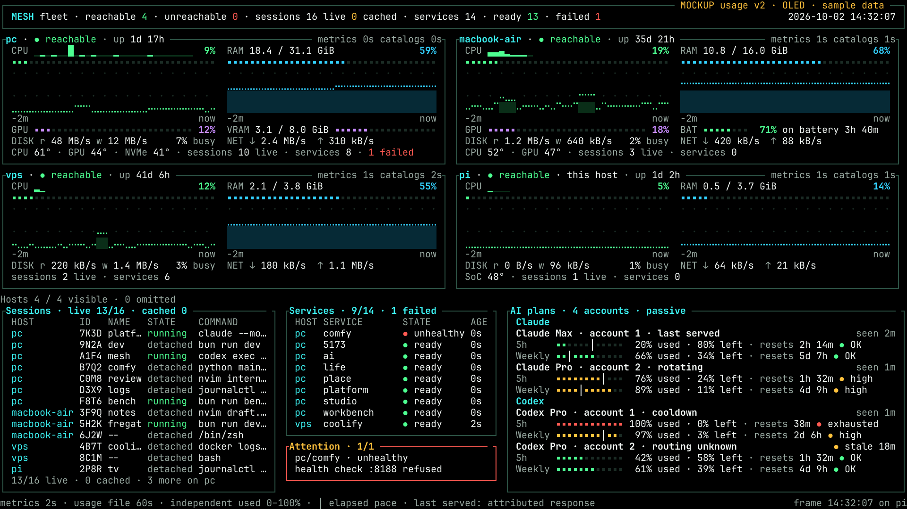

# Generic usage feed on the TV dashboard

Status: Approved, 2026-10-02. Planning/design only; no runtime changes in this PR.

Canonical source inventory, contract, mockups and gateway implementation plan:
[Fregat Plan 287](https://github.com/ShaulLavo/fregat/blob/plan/tv-usage/plans/287-proxy-usage-feed.md).
This extends [07: terminal fleet dashboard](07-dashboard.md); it does not replace
its host watch transport, session details, theme or Pi setup work.

## Boundary

Mesh is a generic read-only viewer of a versioned JSON snapshot. The producer
belongs to Fregat's existing Claude/GPT gateway tooling beside CLIProxyAPI.
It captures Claude quota headers from normal traffic and reads the proxy's
already-recorded per-account GPT quota/cooldown state through localhost management.
The owner selected the proxy as the source because it rotates independently
authorized Pro and Pro Lite accounts. Fregat's present native usage cache is
outside this build; later Fregat consumption of this feed is a separate follow-up.

No provider collector, OAuth handling, quota probing, account selection or reset
logic belongs in Mesh. No new dependency is needed: Go's HTTP/JSON support and
existing dashboard projection/rendering suffice. Keep the data out of fleet host
metrics and the session protocol.

## Producer prerequisite and URL

The running proxy currently has management disabled. The coordinator will enable
loopback-only management with a generated secret in a mode-0600 file, then restart
at a quiet moment: live Sol/GPT calls and subagents can be interrupted. This is
scheduled work in Plan 287, not performed by this plan PR. The Pi never receives
that secret or an inference key.

A dedicated sanitized directory is served through a **tailnet-only isolated
static route**, for example `https://omarchy.mesh.shaulavo.dev/ai-usage/v1.json`.
This example route is not provisioned yet. It is separate from the on-demand
`/ai` backend and keeps serving the last file while inference sleeps. Static
serving belongs to the existing Mesh daemon, not a new collector service.

Feed reads must not start `/ai`, extend its idle deadline, invoke readiness or
model discovery, touch providers, refresh credentials, drain the proxy usage
queue, or wake a host. An unreachable producer means cached/stale data on the Pi.
Tailnet ACLs and route isolation protect the sanitized feed; ordinary browser
Origin/device pairing from Fregat is not the Go client's authentication mechanism.

## Contract to consume

Use Plan 287's JSON v1 schema, not a provider response shape:

- `schemaVersion`, publication `generatedAt`, and all known `accounts`.
- Account opaque stable `id`, generic `provider`, safe `label`, `plan`, `state`,
  `source`, cache-inspection `checkedAt`, actual quota-observation `lastSeenAt`.
- `routing {mode, active, lastServedAt}`: active is boolean or **null**;
  cooldown contains a sanitized reason/recovery time or null.
- `windows[]`: stable ID, label, `usedPercent`, `resetsAt`, `windowMinutes`,
  normalized status, `lastSeenAt`, source. Missing percentage/reset/length is null.

Publication and cache inspection do not refresh observation age. Keep windows
independent; never sum percentages, derive quotas from token counters, assume a
primary window is five hours, or infer 100% used from a generic 429. Unknown
account selection stays unknown. Installed proxy management's `active` is
credential availability and its recent-request counts are ten-minute buckets;
neither proves which account is currently serving. Multiple accounts can serve
concurrently. `last served` is permitted only with positively attributed traffic.

Preserve all known identities at startup with no-data/null timestamps. Preserve
last valid data through failures. After a reset passes, show `reset passed ·
awaiting traffic` or no current data; never refill to 0% without an observation.

## Implementation

- [ ] Add optional sanitized-feed URL to existing local config and its validation.
      With no URL, keep today's dashboard unchanged. No provider secrets/config.
- [ ] Add a small client/projection beside `internal/cli/dashboard_monitor.go`
      and dashboard types. At most one HTTP request per 60 seconds, one in
      flight, bounded timeout and 64 KiB response, normal TLS verification.
      Cancel with monitor shutdown. No wake, activation or provider redirects.
- [ ] Strictly validate v1 values. Unsupported schema, malformed/oversized data,
      timeout or HTTP failure retains the previous valid snapshot whole and
      exposes freshness/unreachable state; do not replace it with an empty view.
- [ ] Compute reset countdown locally. Use each window's lastSeenAt for age and
      a 15-minute stale threshold. Keep account/window order stable. Feed fetches
      never change lastSeenAt or fabricate routing information.
- [ ] Compose the panel with existing `internal/tui/dashboard_tables.go` and
      `dashboard_render.go` glyphs/themes. Keep renderer provider-agnostic.

## 160×45 wall layout (awaiting owner approval)

[Overflow: six accounts across three providers](images/usage-panel-overflow.png)

Four host cards keep their four-row graphs in rows 0–26, in RAM order, with the OLED theme. Rows 27–43 are three columns:
- Sessions: columns 0–56.
- Services and Attention: columns 58–104.
- Usage: columns 106–159.

Usage groups accounts under a provider line (Claude, Codex, and future providers). Each account takes three rows:
- an identity line: plan, neutral account label, `last served` / `rotating` / `cooldown` / `routing unknown`, and `seen` / `stale`;
- one line per aggregate window (5h, weekly), each with its own meter, % used, % left, reset countdown and status word.

When accounts don't fit, the provider line shows `+N more`; the panel never pages or scrolls.

Sessions retain 13/16 visible rows, Services 9/14, Attention the full unhealthy
service name and reason. Session names/commands narrow and its per-row age drops;
host catalog ages remain. Service width narrows; Attention's reason gains a body
line. No host data/graph height or reported failure disappears.

- `20% used · 80% left · resets 2h 14m`; account `seen 2m` or `stale 18m`.
- Existing 28-cell used-share meter: green below 75%, amber at ≥75%, red exhausted;
  explicit `OK`, `high`, `exhausted` words and status dot duplicate color.
- `│` shows elapsed share of a known quota window, not predicted capacity. Hide
  it when stale, exhausted, reset-passed or unknown. Unknown has no filled bar.
- No-data keeps known account labels and `seen —`; expected-window placeholders
  cannot assert a real unobserved allowance.
- Keep model-scoped windows in the feed; visible extra-window/omitted-account
  counts accompany stable ordering when the panel cannot fit them. No auto-paging.
- At 80×24 and intermediate widths, use compact account/window text, shorten
  session detail first and preserve fleet/failure visibility. Below the supported
  minimum, use the dashboard's resize state. Add deterministic resize tests.

All sample percentages/countdowns/routing badges are illustrative, including Pro
Lite; live proxy quotas were unavailable before management enablement. PNG/SVG/TXT
were generated and PNGs read back. The generator asserts 160×45 and compares four
host cards cell-for-cell with v2. Existing Current palette has ≥4.5:1 text/status
contrast; numbers/status words give non-color encoding. This is design evidence,
not a running Pi capture.

## Narrow checks and delivery

- [ ] `httptest` fixtures, injected clock/client: v1/no-data/two rotating accounts,
      per-window observation ages, cancellation, at-least-60-second cadence,
      bounded bodies/timeouts, bad schema and last-good retention. Counters prove
      no extra request caused by screen renders or multiple consumers.
- [ ] Dashboard projection/render snapshots at 160×45 with four hosts/three
      accounts; no-data/stale/75%/100%/reset-passed, unknown routing, model windows,
      account overflow, ASCII fallback, 80×24 and resizing. Run only affected Go
      package/tests; `go vet` and the existing delivery gates when code lands.
- [ ] Integration proof with inference asleep: repeated static GETs leave `/ai`
      asleep and its idle deadline unchanged. With producer unreachable, keep
      prior data and observe no wake call. Production/provider probes are not CI.
- [ ] Read real terminal screenshots against the approved mockup, then verify on
      the Pi TV. Keep machine-specific proof outside portable committed tests.
- [ ] Commit/push owned paths, independent review, then update Mesh/Pi and the
      gateway/static route at the coordinator's quiet moment. No runtime deploy
      or proxy restart in this documentation-only PR.

## Acceptance

All three configured accounts are independently visible, including no-data/stale
ones. Every observed window has used/left/reset/freshness; unknown stays unknown.
Reads add **zero provider calls, zero inference demand, and zero host wake-ups**.
Four hosts remain visible at the target TV size. Setup does not give the Pi
provider credentials. Exact active attribution can remain unknown without
blocking this feature. Fregat's own active probes remain unchanged until its
separately scoped feed-consumer follow-up.
