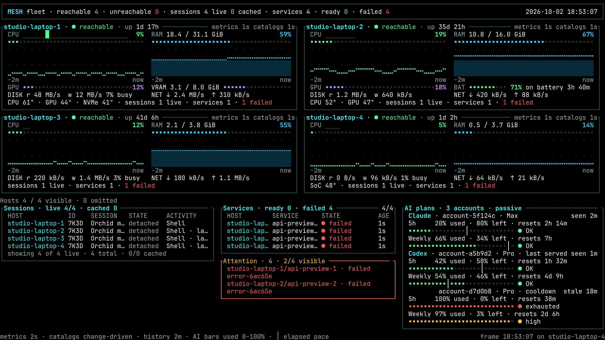
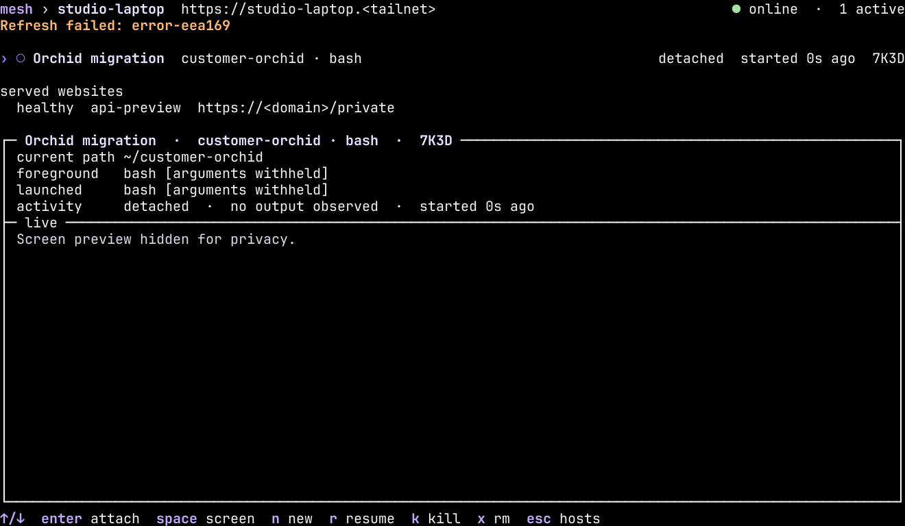

# Privacy mode

Privacy mode gives Mesh a recording and screen-sharing view of your fleet.
It replaces personal metadata with readable aliases while keeping machine
statistics, usage quotas, session states, freshness, and service health visible.

```bash
mesh --privacy dashboard
mesh --privacy dashboard --wall
mesh --privacy                  # browse the picker and inspector
mesh --privacy ls --all
mesh --privacy serve ls
```

Set `MESH_PRIVACY=1` for a recording shell so each Mesh invocation uses privacy
mode. The values `true`, `yes`, and `on` also enable it.

```bash
export MESH_PRIVACY=1
mesh dashboard --wall
mesh ls
mesh --privacy=false ls          # explicitly reveal details
```

## What appears on screen

Plain host names, session names and titles, service labels, and useful path
suffixes stay readable. Privacy mode scrubs embedded usernames, home-directory
owners, UUIDs, domains, and IP addresses. Home paths such as
`/home/private-owner/project` appear as `~/project`. URLs retain useful scheme
and path information with private authorities sanitized.

Provider-account labels always appear as opaque aliases, including labels that
contain no email address. The same masked value has the same alias throughout
one Mesh invocation, including refreshed frames. Each invocation has a fresh
random key, so aliases change when you restart Mesh.

Commands show their executable and an arguments-hidden marker. Provider names,
plan names, quota readings, CPU, RAM, temperatures, disk and network activity,
session IDs, states, ages, and service health stay readable.

The inspector displays a privacy placeholder for both live and saved terminal
screens. `mesh logs`, including `--previous`, displays the same kind of placeholder.
Terminal output can contain passwords, tokens, and private prose with no
recognizable pattern. Applying the metadata text filter to that output would
leave those secrets visible, so previews and logs remain withheld. Arbitrary
error details stay opaque for the same reason; diagnostic status stays readable.
Application setup output and browser payloads are hidden too. App text and JSON results
mask identifiers and private fields while the app operations use their original
values. Human-readable GC, update, agent recovery, and host-management messages
also mask their private metadata.

While privacy is active, the dashboard keeps its current executable through
local daemon updates. A different installed binary may predate privacy support
and silently ignore `MESH_PRIVACY`. When its daemon's binary changes, the dashboard
shows a one-line skipped-restart notice; restart it manually after recording.
Ordinary dashboards keep their automatic restart behavior.

Privacy mode keeps the real fleet identities and session data for lookup and
control. Masking happens when Mesh presents data; caches, configuration, command
arguments sent to hosts, and saved output retain their original values.

## Recording safely

Start with a fresh terminal, enable privacy mode, and open the view you want to
record. Check the frame at your intended terminal size before recording. Keep
other windows, shell prompts, terminal scrollback, desktop notifications, and
previous unmasked output and personally identifying typed input outside the
recording area.

A deliberately attached session shows that program's own output as-is; privacy
mode continues to mask Mesh's fleet views when you return to them.

Update JSON reports are for scripts and carry original data. Generated shell
setup scripts, hook snippets, and downloaded archives also carry original data.
Use those outside the recording area. Use `--privacy=false` when copying real
paths, IDs, URLs, or the sample SSH command from a masked view.

Mesh's privacy view covers the Mesh presentation surfaces listed above. Other
programs, exported files, external browsers, and operating-system UI each need
their own recording precautions. Use synthetic data for public captures of
administrative workflows outside those views.

## Synthetic examples

These production-renderer frames use invented fleet identities.





Regenerate before/after evidence with
`scripts/render-privacy-fixture.sh /work/tmp/mesh-privacy-mask-evidence`.
